EKS Continuous Integration/Continuous Delivery (CI/CD)
======================================================

**Expected Outcome:**

-   300 level understanding of Kubernetes Continuous Deployment:

    -   Create a source code repository using AWS CodeCommit.

    -   Configure a CI/CD pipeline using AWS CodePipeline.

    -   Deploy AWS CodeBuild to build your container image and push to
        ECS.

**Lab Requirements:**

-   Cloud9 IDE.

-   an Amazon Elastic Container Service for Kubernetes Cluster.

**Average Lab Time:** 30-45 minutes

Introduction
------------

This module is designed to improve your understanding of the [AWS
Code\*](https://aws.amazon.com/codestar/) services like, [AWS
CodeCommit](https://aws.amazon.com/codecommit/), [AWS
CodeBuild](https://aws.amazon.com/codebuild/), [AWS
CodePipeline](https://aws.amazon.com/codepipeline/) and [AWS
Lambda](https://aws.amazon.com/lambda/) can be used for continuous
deployment on [Amazon EKS](https://aws.amazon.com/eks/).

The following **Reference Architecture** details the how the above AWS
services will be leveraged and the specific steps we will follow for
this module.

Reference Architecture
----------------------

Setting up the CI/CD Pipeline
-----------------------------

> **Note**
>
> The following section of the module assumes a working EKS cluster,
> created in **Amazon EKS** module.

To start, we need to assign a **ServiceRole** to CodePipeline, as
permissions for some aspects of the pipeline execution process are
granted to another role type that acts on behalf of CodePipeline, like
EKS, rather than to IAM users.

The Service role is an IAM role that gives CodePipeline permission to
use resources in your account. Service role creation is only required
the first time you create a pipeline in CodePipeline.

CodePipeline uses this service role when processing revisions through
the stages and actions in a pipeline. That role is configured with one
or more policies that control access to the AWS resources used by the
pipeline. You might want to attach additional policies to this role,
edit the policy attached to the role, or configure policies for other
service roles in AWS. You might also want to attach a policy to a role
when configuring cross-account access to your pipeline.

Step 1  
In the Cloud9 IDE `terminal`, navigate to this module’s working
directory.

    cd ~/environment/aws-modernization-workshop-advanced/modules/cicd/

Step 2  
Next, we will create the necessary Service Roles using the
CloudFormation template in this module;s working directory by running
the following AWS CLI command:

    aws cloudformation create-stack --stack-name "${USER_NAME}-cicd-roles" \
    --template-body=file://eks-cicd-roles-template.yaml \
    --capabilities CAPABILITY_IAM

Example Output:

    {
        "StackId": "arn:aws:cloudformation:us-west-2:<REDACTED>:stack/workshop-cicd-roles/686a6510-79b7-11e9-a777-0a58a0e3e17a"
    }

Step 3  
Wait for the Template to finish deploying by running the following
command:

    until [[ `aws cloudformation describe-stacks --stack-name "${USER_NAME}-cicd-roles" --query "Stacks[0].[StackStatus]" --output text` == "CREATE_COMPLETE" ]]; do  echo "The stack is NOT in a state of CREATE_COMPLETE at `date`";   sleep 30; done && echo "The Stack is built at `date` - Please proceed"

### Create Container Repository

As we saw with the other examples in this workshop, we will need to
store our demo applications' docker containers, so next we’ll create an
AWS ECR repository for the application containers by running the
following command:

    aws ecr create-repository --repository-name ${USER_NAME}-cicd-repo --region us-west-2

Example Output:

    {
        "repository": {
            "registryId": "<REDACTED>",
            "repositoryName": "eks-cicd-demo-repo",
            "repositoryArn": "arn:aws:ecr:us-west-2:<.REDACTED>:repository/eks-cicd-demo-repo",
            "createdAt": 1558127545.0,
            "repositoryUri": "<REDACTED>.dkr.ecr.us-west-2.amazonaws.com/eks-cicd-demo-repo"
        }
    }

### Create Source Version Control for the Demo Application

Step 1  
Next, we will create an AWS CodeCommit repository to store the source
code for our sample EKS project. This is the source code for the
application we are "developing" and will eventually push to "production"
using our CI/CD Pipeline. Execute the following command in the Ckoud9
`terminal`.

    aws codecommit create-repository --repository-name ${USER_NAME}-cicd-demo-repo --repository-description "EKS CICD demo application repository for ${USER_NAME}" --region us-west-2

Example Output:

    {
        "repositoryMetadata": {
            "repositoryName": "eks-cicd-demo-repo",
            "cloneUrlSsh": "ssh://git-codecommit.us-west-2.amazonaws.com/v1/repos/eks-cicd-demo-repo",
            "lastModifiedDate": 1558126857.734,
            "repositoryDescription": "EKS CICD demonstration repository",
            "cloneUrlHttp": "https://git-codecommit.us-west-2.amazonaws.com/v1/repos/eks-cicd-demo-repo",
            "creationDate": 1558126857.734,
            "repositoryId": "1d5e262b-ff0a-4555-a552-31a87db6373a",
            "Arn": "arn:aws:codecommit:us-west-2:<REDACTED>:eks-cicd-demo-repo",
            "accountId": "<REDACTED>"
        }
    }

Step 2  
Next we will commit our sample application to the CodeCommit repository
created above, by running the following commands:

    git config --global credential.helper '!aws codecommit credential-helper $@'

    git config --global credential.UseHttpPath true

    git clone https://git-codecommit.us-west-2.amazonaws.com/v1/repos/${USER_NAME}-cicd-demo-repo

    cp ./sample-app/* ${USER_NAME}-cicd-demo-repo/

    cd ${USER_NAME}-cicd-demo-repo

    git add . && git commit -m "initial commit of sample app" && git push origin master

### Create the CI/CD Pipeline

Step 1  
Now that we have a place to store our docker container, a source code
repository and the necessary Service roles, we can create our CI/CD
Pipeline. Open a browser tab and navigate to the [AWS
CodePipeline](https://us-west-2.console.aws.amazon.com/codesuite/codepipeline/pipelines)
Service Console. Click on **Create pipeline**.

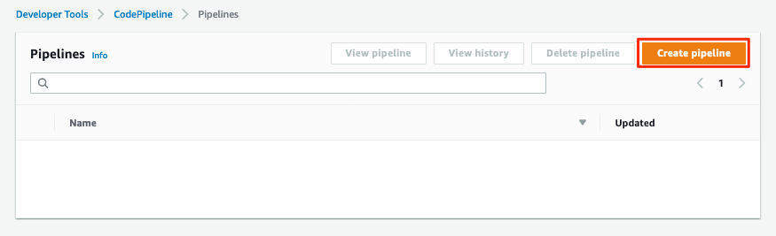

Step 2  
After the **Create new pipeline** wizard opens, the first step is to
configure the **Pipeline settings**. Enter
`[red yellow-background]#<User Name>#-CICD-Demo` (*substituting your
unique user name*), as the **Pipeline name**.

Select **Existing service role** and from the drop-down, select the IAM
role we created in **Step 2**.

> **Note**
>
> The **Role name** should start with
> `[red yellow-background]#<User Name>#-cicd-roles-CodepipleServiceRole-...`.

Step 3  
Expand the **Advanced settings**, under **Artifact store**, click
**Custom location**. From the **Bucket** drop-down list, select the S3
Bucket created in **Step 2**.

> **Note**
>
> The **Bucket** name should start with
> `[red yellow-background]#<User Name>#-cicd-demo-roles-ekscicddemobucket-...`.

Step 4  
Click on **Next** to continue.

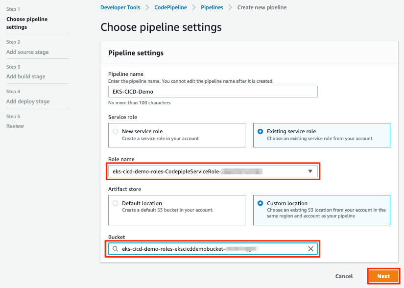

Step 5  
Next we’ll configure the **Source stage**. Click the drop-down and
select **AWS CodeCommit** as the **Source provider**.

Step 6  
For the **Repository name**, click the drop-down to select the
repository we created in **Step 4**.

Step 7  
Select the `master` branch from the drop-down for **Branch name**.

Step 8  
Keep the default recommended setting for **Change detection options** as
**AWS CodePipeline** and click **Next**.

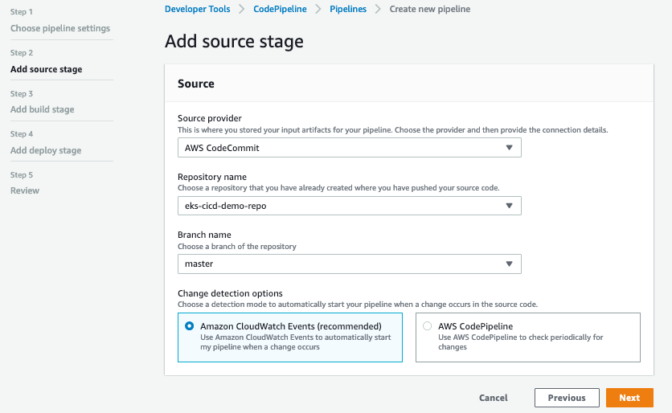

Step 9  
Now we configure the **Build stage**. Click the drop-down and select
**AWS CodeBuild** and then click the **Create project** link to create a
new CodeBuild project.

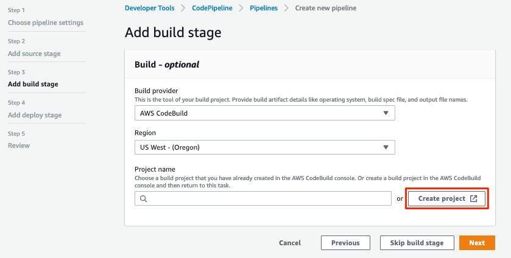

Step 10  
A new browser window will open to create a new build project. Under the
**Project configuration** section, enter
`[red yellow-background]#<User Name>#-build-project` as the **Project
name** (*substituting your unique user name*) and provide an optional
**Description**.

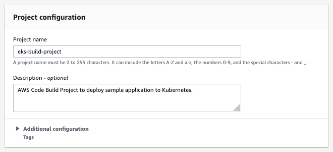

> **Tip**
>
> Even though it’s not required for this workshop, it’s always a good
> practice to tag your AWS resources for *Cost Allocation*, *Access
> Control*, *Business Organization* and *Automation*. You can read more
> about Tagging Strategies
> [here](https://aws.amazon.com/answers/account-management/aws-tagging-strategies/).

Step 11  
Under the **Environment** section, ensure that **Managed image** is
selected.

Step 12  
From the **Operating system** drop-down box, select **Ubuntu**.

Step 13  
Leave the **Runtime** as **Standard** and ensure that the you select
`aws/codebuild/standard:2.0` as the **Image**.

Step 14  
Ensure that **Privileged** check-box is **checked**.

Step 15  
For the **Service role**, select **Existing service role** and choose
the role we created in **Step 2**.

> **Note**
>
> The **Role name** should start with
> `[red yellow-background]#<User Name>#-cicd-demo-roles-CodeBuildServiceRole-...`.

Step 16  
**Uncheck** the **Allow AWS CodeBuild to modify this service role**
check-box.

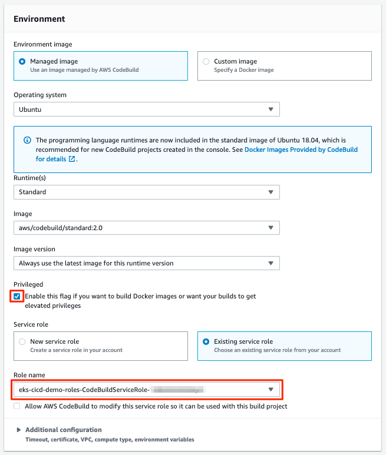

Step 17  
Expand the **Additional configuration** section and add the following
**Environmental variables** as the `Name`:

-   `AWS_ACCOUNT_ID` - Add your 12-digit AWS Account provided as the
    value.

-   `IMAGE_REPO_NAME` - Add
    `[red yellow-background]#<User Name>#-cicd-repo` as the value
    (*substituting your unique user name*).

    > **Important**
    >
    > Make sure there are no spaces in any of the values entered!

    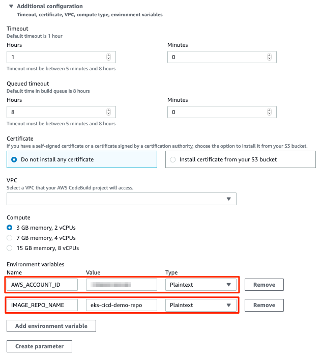

Step 18  
Leave the rest of the fields as their default and click **Continue to
CodePipeline**. You will be returned to the CodePipeline build stage.
Click **Next** to continue.

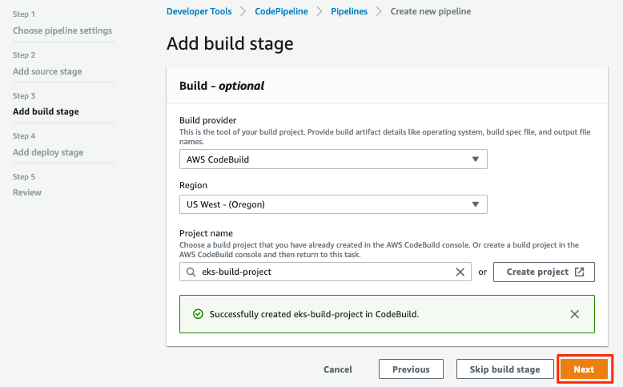

Step 19  
Click **Skip deploy stage** and confirm.

> **Note**
>
> We will not create a **Deployment Stage** to our pipeline because we
> will leverage an [AWS Lambda](https://aws.amazon.com/lambda/) to
> handle the deployment to Kubernetes.

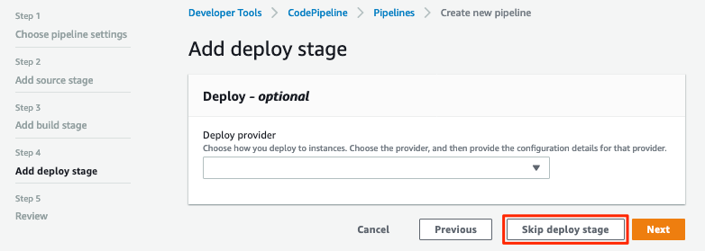

Setp 20  
Review the CodePipeline configuration and click **Create Pipeline**.

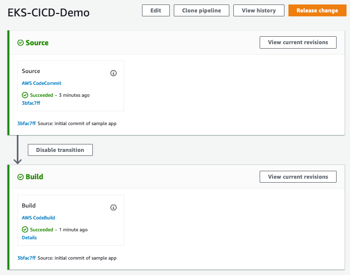

### Configure the Deployment Lambda Function

Now that we have created and tested the build of our pipeline in
CodePipeline, we will next create an AWS Lambda function to as as a
Kubernetes client and deploy the application to EKS.

Step 1  
Let’s get started setting up the lambda function by first ensuring we
are using this part of the modules' working directory. In the Cloud9 IDE
`terminal`, run the following command:

    cd ~/environment/aws-modernization-workshop-advanced/modules/cicd/lambda-eks

Step 2  
Next, we will add some of our EKS parameters to the lambda
configuration, by running the following commands

    sed -i -e "s#\$EKS_CA#$(aws eks describe-cluster --name ${USER_NAME}-petstore --query cluster.certificateAuthority.data --output text)#g" ./config

    sed -i -e "s#\$EKS_CLUSTER_HOST#$(aws eks describe-cluster --name ${USER_NAME}-petstore --query cluster.endpoint --output text)#g" ./config

    sed -i -e "s#\$EKS_CLUSTER_NAME#${USER_NAME}-petstore#g" ./config

    sed -i -e "s#\$EKS_CLUSTER_USER_NAME#lambda#g" ./config

These commands will:

1.  Add the EKS Certificate to the deployment lambda configuration.

2.  Add the EKS Endpoint to the deployment lambda configuration.

3.  Add the EKS Cluster name to the deployment lambda configuration.

4.  Add an EKS Cluster user and context, called `lambda`, to the
    deployment lambda configuration.

    > **Note**
    >
    > Running the above command assumes a working EKS cluster, called
    > `petstore`, created in **Amazon EKS** module.

Step 3  
Next, we create a [Kubernetes
Secret](https://kubernetes.io/docs/concepts/configuration/secret/) to
give our deployment lambda access to the EKS cluster. First, we need to
get the `secrets` resource.

    SECRET_NAME=$(kubectl get secrets -o json | jq -r '.items[].metadata["name"]') && \
    echo $SECRET_NAME

Example Output:

    default-token-wnlw5

Step 4  
Now we update the deployment lambda configuration file with the secrets
token from the above output.

    sed -i -e "s#\$TOKEN#$(kubectl get secret $SECRET_NAME -o json | jq -r '.data["token"]' | base64 -d)#g" ./config

Step 5  
Next, we build out lambda function, package the necessary JavaScript
resources and then deploy it by running the following commands:

    npm install

    zip -r lambda-package_v1.zip .

    export LAMBDA_SERVICE_ROLE=$(aws cloudformation describe-stacks --stack-name ${USER_NAME}-cicd-roles | jq -r '.Stacks[0].Outputs[]|select(.OutputKey=="LambdaExecutionRoleArn")|.OutputValue')

    aws lambda create-function --function-name ${USER_NAME}-LambdaKubeClient \
    --runtime nodejs8.10 --role $LAMBDA_SERVICE_ROLE --handler index.handler  \
    --zip-file fileb://lambda-package_v1.zip --timeout 10 --memory-size 128

These commands will:

1.  Install the JavaScript package manager.

2.  Compress the JavaScript packages for lambda deployment.

3.  Get the [Amazon Resource Name
    (ARN)](https://docs.aws.amazon.com/general/latest/gr/aws-arns-and-namespaces.html)
    for the IAM Service Role that gives lambda the necessary EKS service
    permissions.

4.  Deploy the lambda function,
    `[red yellow-background]#<User Name>#-LambdaKubeClient`, using the
    AWS CLI.

Example Output:

<!-- -->

    {
        "TracingConfig": {
            "Mode": "PassThrough"
        },
        "CodeSha256": "47bY+tj2yvUpBeYUXYg0/uNeJJP2GdizPwRxM8bjfnE=",
        "FunctionName": "LambdaKubeClient",
        "CodeSize": 18757441,
        "RevisionId": "e9399fed-415d-4158-bab3-e29040c0aa5d",
        "MemorySize": 128,
        "FunctionArn": "arn:aws:lambda:us-west-2:<REDACTED>>:function:LambdaKubeClient",
        "Version": "$LATEST",
        "Role": "arn:aws:iam::<REDACTED>>:role/eks-cicd-demo-roles-LambdaExecutionRole-1QTWXPK4U9Z2T",
        "Timeout": 10,
        "LastModified": "2019-05-21T17:46:04.885+0000",
        "Handler": "index.handler",
        "Runtime": "nodejs8.10",
        "Description": ""
    }

Step 6  
Now that oiur deployment lambda function has been created and deployed
within our AWS Account, we need to provide it with admin access to the
Kubernetes cluster. This is accomplished by providing it with Role-based
access control
([RBAC](https://kubernetes.io/docs/reference/access-authn-authz/rbac/))
to the default service account. Create a role binding by running the
following command:

    kubectl create clusterrolebinding default-admin --clusterrole cluster-admin --serviceaccount=default:default

Expected Output:

    clusterrolebinding.rbac.authorization.k8s.io/default-admin created

### Add the Deployment Stage to the Ci/CD Pipeline

Now that all our components are in place, we need to add a
**Deployment** stage to our CI/CD pipeline, in order to deploy our Demo
Application to Kubernetes i.e. into production.

Step 1  
In your browser, navigate to the [AWS
CodePipeline](https://us-west-2.console.aws.amazon.com/codesuite/codepipeline/pipelines)
Service Console and click on the
`[red yellow-background]#<User Name>#-CICD-Demo` pipeline we created.

Step 2  
To add a new stage to our pipeline, click the **Edit** button.

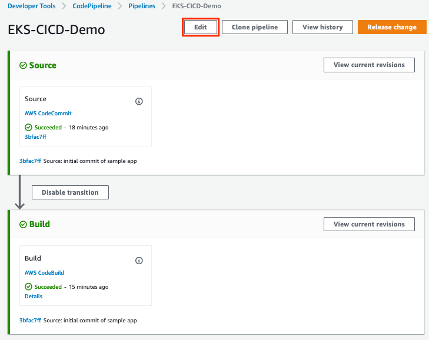

Step 3  
Next, we add a new stage after our **Build** stage by clicking the **Add
stage** button.

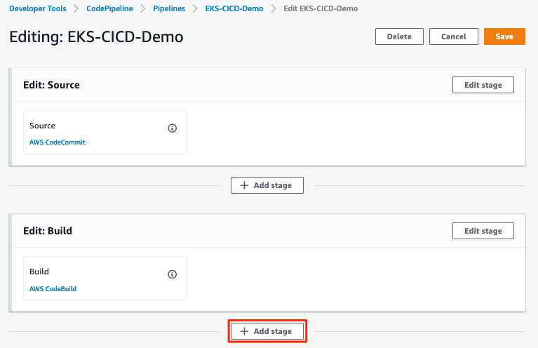

Step 4  
When prompted, to provide the **Stage name**, enter **Deploy** and click
the **Add stage** button.

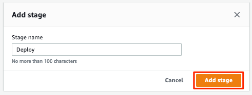

Step 5  
We now have a new stage to our pipeline called **Deploy**. Next, we need
to configure the actions that this stage needs to perform for our
pipeline. To get started, click on the **Add action group** button.

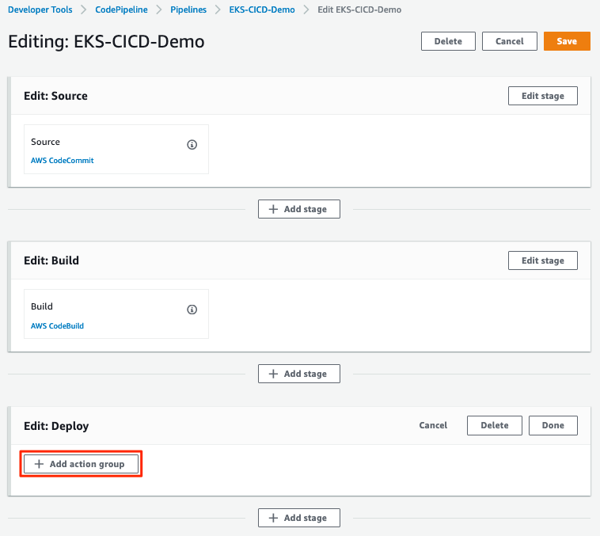

Step 6  
Once the **Edit action** dialogue opens, enter `LambdaKubeClient` as the
**Action name**.

Step 7  
Select **AWS Lambda** as the **Action provider**.

Step 8  
For the **Input artifacts**, select the **BuildArtifact** as the
previous stage to our Deploy stage.

Step 9  
From the **Function name** drop-down box, select the
`[red yellow-background]#<User Name>#-LambdaKubeClient` funciton that
was created in the previous section (*substituting your unique user
name*).

Step 10  
In order to tell the function where to get the Demo Application docker
image, enter `[red yellow-background]#<User Name>#-cicd-repo` as a
lambda event parameter to our deployment lambda function (*substituting
your unique user name*).

Step 11  
Click on the **Done** button to save our action configuration.

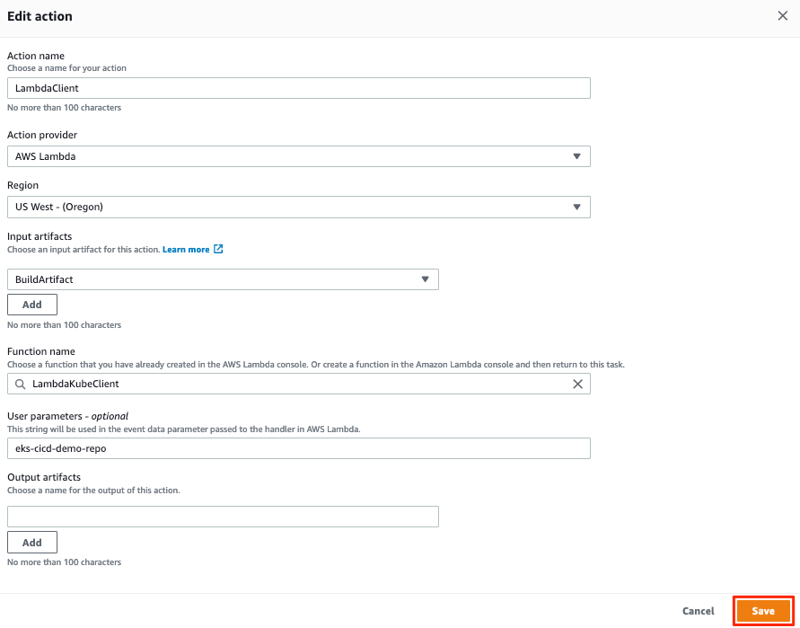

Step 12  
Click **Save** to update our pipeline changes.

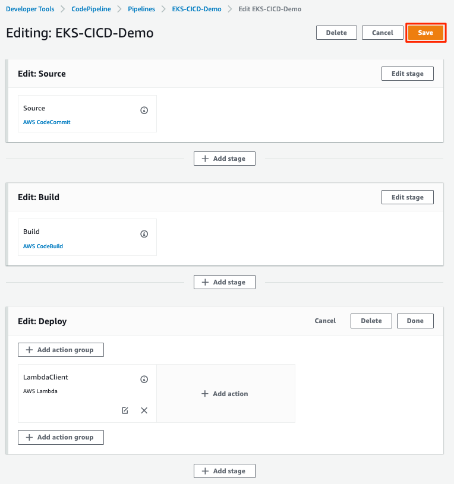

Executing the CI/CD Pipeline
----------------------------

We now have a complete CI/CD pipeline that takes any code changes,
triggered from our Source Version Control repository, creates a new
Kubernetes deployment container and deploys this into production on our
EKS cluster. To simulate the entire CI/CD process, click the **Release
change** button to trigger the pipeline.

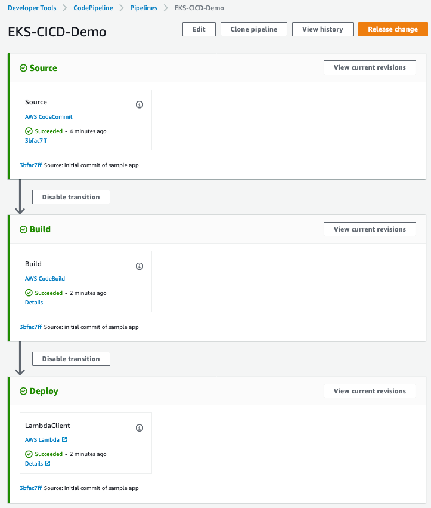

Once the pipeline has completed, we can confirm our Demo Application is
running production by executing the following command in our Cloud9 IDE
`terminal`.

    kubectl get deployment ${USER_NAME}-cicd-repo -o wide

Example Output:

    NAME                 DESIRED   CURRENT   UP-TO-DATE   AVAILABLE   AGE    CONTAINERS           IMAGES                                                                   SELECTOR
    eks-cicd-demo-repo   1         1         1            1           124m   eks-cicd-demo-repo   <REDACTED>>.dkr.ecr.us-west-2.amazonaws.com/eks-cicd-demo-repo:latest   name=eks-cicd-demo-repo

Feel free to make some code changes to the application source and see
those changes get driven into production using your new CI/CD pipeline.
