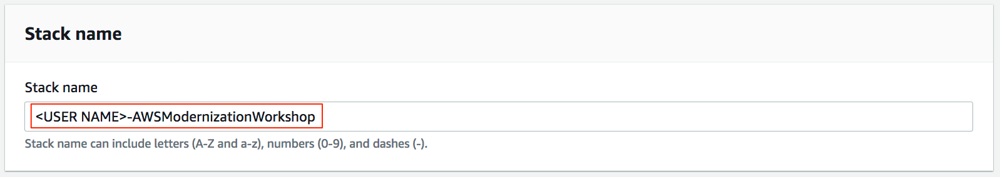
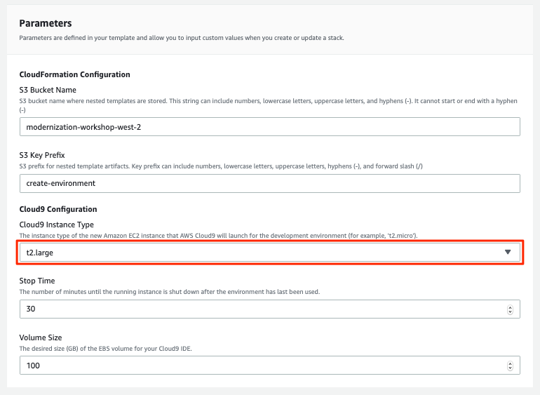
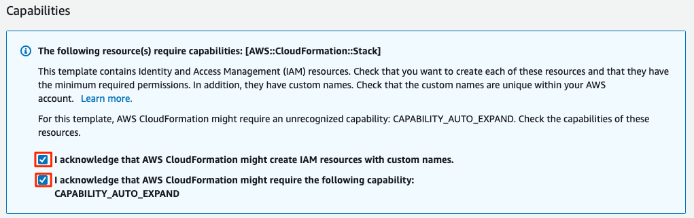

Creating the Workshop Environment
=================================

**Lab Requirements:**

-   An AWS account provided to you by the AWS Instructor.

-   Working Laptop with Internet Access.

**Note:**

-   All AWS resources used for this workshop are to be created in the
    **us-west-2** AWS Region.

-   Any resources created during the workshop must be named with the
    **IAM User** provided.

Workshop Introduction
---------------------

Welcome to the workshop on AWS Digital Modernization. The steps outlined
below will allow you to quickly create an environment that will allow
you to work with the instructions contained throughout this workshop.

> **Note**
>
> If you do not receive an e-mail with the **AWS Account** and **IAM
> User**, please see the AWS Instructor.

Create the Workshop environment using CloudFormation
----------------------------------------------------

Throughout the workshop you will be tagging and naming resources that
you create so as to differentiate your resources from the other workshop
attendees.

To effectively differentiate your AWS resources, you will need to come
up with a unique user name. The unique user name must be seven
characters in length.

During the workshop, we will refer to this unique username with the
**&lt;USER\_NAME&gt;** parameter. So whenever you see this, substitute
your unique user name.

Step 1  
To get started, log into the **AWS account** with the **IAM User** name
(*this should be your e-mail address*), that was provided to you by the
AWS Instructor.

Click **Deploy to AWS**.

Step 2  
Provide a unique **Stack name** by replacing **&lt;USER NAME&gt;** with
your unique user name to the beginning of `AWSModernizationWorkshop`.

This will allow your CloudFormation stack to be uniquely identifiable.

> **Tip**
>
> For example, if your unique user name is **bobcat1**, the **Stack
> name** parameter will look as follows:
>
>     bobcat1-AWSModernizationWorkshop

Step 3  
Select `t2.large` as the **Cloud9 Instance type**.

Step 4  
Keep the other parameters at their default.

Step 5  
Check both **Capabilities** check-boxes.

Step 6  
Click **Create Stack**.

The CloudFormation Template will create the following resources in your
AWS Account:

-   `C9InstanceFunctionRole` - IAM Role for access to AWS resources
    created suring the Workshop.

-   `C9InstanceFunction` - Lambda Function to map the IAM Role to the
    Cloud9 Instance.

-   `C9InstanceCR` - Cloud9 IDE Instance.

It should take around **15 minutes** for the environment to be deployed.
Use the [AWS
CloudFormation](https://us-west-2.console.aws.amazon.com/cloudformation/home?region=us-west-2)
service console to see the status of you stack. Once the environment has
been deployed, you will see the **CREATE\_COMPLETE** message for your
**&lt;User\_Name&gt;-AWSModernizationWorkshop** stack. Once you see
this, you may proceed with the additional configuration steps in the
**Getting Started** module.
